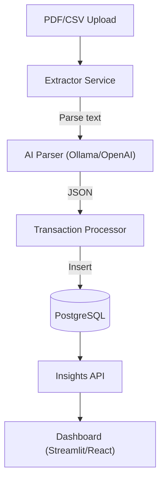
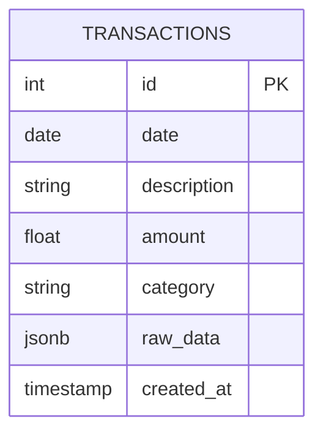

# Finance Assistant – Architecture

## Overview

The system ingests **PDF bank statements** and **CSV files**, extracts structured data with AI, stores it in PostgreSQL (with JSONB for raw data), and generates insights + dashboards.

## Flow Diagram

## Database Model

* `raw_data`: Original parsed object (flexible schema).
* `category`: Can be assigned by AI or user-corrected.
